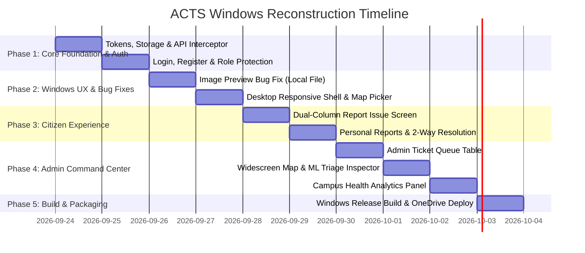

# 🚀 ACTS - Windows Desktop & Mobile Modernization Roadmap

> **Document Version:** 1.0.0  
> **Target Platforms:** Windows Desktop (`.exe`), Android (`.apk`), Cross-Platform Flutter  
> **Project Root:** `D:\LetsCode\ACTS_project-main`  
> **Last Updated:** 2026-09-24  

---

## 📌 1. Executive Summary & Objective

The **Automated Civic Triage System (ACTS)** currently contains a Flutter client (`mobile/`) originally structured for mobile phones. While it builds as a Windows executable (`acts_mobile.exe`), it lacks desktop-grade UX, has critical media rendering bugs, completely lacks an Authentication/Role system, and exposes administrative triage controls to unauthenticated citizens.

This roadmap tracks the step-by-step transformation of ACTS into a dual-mode, production-grade application that natively excels on **Windows Desktop** (wide screen, sidebar navigation, file picker, desktop map controls) while preserving full mobile responsiveness.

---

## 🐛 2. Master Bug & Loophole Registry

| ID | Severity | File Path | Bug / Loophole Description | Target Phase | Status |
|---|---|---|---|---|---|
| **BUG-01** | 🔴 Critical | `mobile/lib/widgets/image_preview_card.dart:32` | `Image.network(imageFile!.path)` used for local photos; always crashes with `broken_image` on Windows/Android. | Phase 2 | ✅ Fixed |
| **BUG-02** | 🔴 Critical | `mobile/lib/main.dart` & `app_routes.dart` | Zero authentication screens. App launches directly into `ReportIssueScreen`. | Phase 1 | ✅ Fixed |
| **BUG-03** | 🔴 Critical | `mobile/lib/screens/citizen/report_issue_screen.dart:153` | Direct button to Admin Command Map and Priority Override in Citizen AppBar without password or role checks. | Phase 1 | ✅ Fixed |
| **BUG-04** | 🔴 Critical | `mobile/lib/services/api_client.dart` | No `Authorization: Bearer <token>` attached. All admin endpoints return 401/403. | Phase 1 | ✅ Fixed |
| **BUG-05** | 🟠 High | `mobile/lib/services/api_client.dart:127` | Hardcoded `user_identifier: 'citizen_mobile'` causes all users to share the exact same complaint history. | Phase 1 & 3 | ✅ Fixed |
| **BUG-06** | 🟠 High | `mobile/lib/services/api_client.dart:9-14` | Hardcoded `10.0.2.2` / `127.0.0.1` breaks on physical Android devices and custom LAN/Docker setups. Needs dynamic config. | Phase 1 | ✅ Fixed |
| **BUG-07** | 🟠 High | `mobile/lib/screens/citizen/report_issue_screen.dart:24` | Silent fallback to hardcoded Ghaziabad coordinates (`28.6692, 77.4538`) when Windows GPS sensor is absent. | Phase 2 | ✅ Fixed |
| **BUG-08** | 🟡 Medium | `mobile/lib/screens/admin/` | Missing Admin Tickets Queue list/table. Only map view exists; admins cannot triage from a list. | Phase 4 | ✅ Fixed |
| **BUG-09** | 🟡 Medium | `mobile/lib/screens/` | Missing Notifications screen in Flutter (exists in backend and React web). | Phase 3 | ⏳ Pending |
| **BUG-10** | 🟠 High | `mobile/lib/` (All Screens) | Missing desktop layout: on widescreen monitors, single vertical mobile columns stretch awkwardly. | Phase 2 | ✅ Fixed |

---

## 🗺️ 3. Phased Execution Tracker

---

### 🔹 Phase 1: Core Foundation, Storage & Auth System
**Objective:** Establish secure JWT authentication, session persistence, role-based navigation, and protected API communication.

- [x] **1.1. Add Dependencies (`mobile/pubspec.yaml`)**
  - Add `shared_preferences: ^2.5.5` for token and role caching.
- [x] **1.2. Auth & Storage Service (`mobile/lib/services/auth_service.dart`)**
  - Token caching (`acts_access_token`, `acts_refresh_token`).
  - User details caching (`username`, `is_admin`).
  - Dynamic Base URL caching (`custom_api_url`).
  - Auto-login check on app startup.
- [x] **1.3. API Client Upgrade (`mobile/lib/services/api_client.dart`)**
  - Attach `Authorization: Bearer <token>` to Dio headers automatically.
  - Implement 401 interceptor with `/api/token/refresh/`.
  - Add `login(username, password)`, `register(username, password, email)` and `logout()` methods.
- [x] **1.4. Auth Screens (`mobile/lib/screens/auth/`)**
  - `login_screen.dart`: Sleek modern card design, username/password fields, role detection, guest shortcut, server URL config.
  - `register_screen.dart`: Citizen self-service registration form.
- [x] **1.5. Route Protection & Shell Controller (`mobile/lib/config/app_routes.dart`)**
  - Auth splash gateway: if logged in -> route to role home; if not -> show login.
  - Isolate Citizen navigation from Admin Command Center (removed direct unauthorized admin map link from citizen screen).

---

### 🔹 Phase 2: Windows Desktop Responsive Shell & Core Bug Fixes
**Objective:** Transform UI into a modern desktop application on widescreen, fix the local image preview crash, and handle Windows GPS limitations.

- [x] **2.1. Fix Image Preview Crash Bug (`ImagePreviewCard`)**
  - Replaced `Image.network(imageFile!.path)` with `kIsWeb ? Image.network(...) : Image.file(File(imageFile!.path))`.
  - Auto-resolved relative network URLs (`/media/...`) with `ApiConstants.baseUrl`.
- [x] **2.2. Responsive & Collapsible App Scaffold (`mobile/lib/widgets/desktop_scaffold.dart`)**
  - Breakpoint detection (`MediaQuery.of(context).size.width >= 800`).
  - **Expandable / Contractable Sidebar:**
    - Animated width transition (250px expanded ↔ 72px collapsed) in 220ms with cubic easing.
    - Preserves collapsed/expanded state across route navigations via static `ValueNotifier`.
    - Collapsed mode features centered icon buttons with micro-tooltips (`Tooltip`) for zero clutter.
    - Dual toggle controls: Chevron toggle in sidebar header + Hamburger button in top navigation bar.
    - Condenses user profile footer into compact avatar badge and quick logout.
  - **Mobile View:** Clean bottom navigation bar with responsive route switching.
- [x] **2.3. Windows Native File Explorer Picker**
  - Adapted image picker for Windows desktop: "Click to Browse Photo from PC" with native file filters.
- [x] **2.4. Interactive Map Pin Dropper for Geolocation**
  - On Windows, if GPS is unavailable, interactive modal with OpenStreetMap allows tapping anywhere on campus to set the incident pin.
- [x] **2.5. Holy Grail 3-Column Layout & Right Auxiliary Panel (`right_auxiliary_panel.dart`)**
  - **Right Auxiliary Panel:** Collapsible 310px sidebar showing role-based telemetry (Campus Pulse & Emergency Helplines for Citizens; Live Triage Metrics & Department Workload for Admins).
  - **Top Bar Controls:** Dedicated panel toggle icon (`view_sidebar_rounded`), live `Campus Engine Online` status pill, and 1-click theme switch.
  - **Widescreen Canvas Redesign:** Removed restrictive 1100px gutter limits, added one-tap campus zone chips, and modern photo drop-zone.

---

### 🔹 Phase 3: Citizen Reporting & History Experience
**Objective:** Provide a fast, beautiful reporting flow with user-specific tracking.

- [x] **3.1. Report Issue Screen Overhaul (`report_issue_screen.dart`)**
  - **Desktop Layout:** Two-column split (Left: Problem description & Campus Zone & Pin; Right: Photo drop-zone & submit action).
  - Eliminated hardcoded `citizen_mobile`; dynamically attaches authenticated `user_identifier` or guest ID.
  - Live AI pre-triage prediction feedback dialog.
- [x] **3.2. My Reports Screen Overhaul (`my_reports_screen.dart`)**
  - Grid card layout on Desktop / List on Mobile.
  - Filter chips by status (`All`, `Submitted`, `In Progress`, `Resolved`, `Reopened`).
  - Search and image thumbnail preview with resolved media URLs.
- [x] **3.3. Two-Way Confirmation & Reopen Dialog**
  - Interactive modal when an issue is marked `RESOLVED`.
  - Option to confirm fix or reopen with feedback remarks.
- [ ] **3.4. Citizen Notifications Screen (`notifications_screen.dart`)**
  - Real-time updates when an issue status changes or crew is dispatched.

---

### 🔹 Phase 4: Admin Command Center (Windows-Optimized)
**Objective:** Build a powerhouse desktop triage workstation for municipality authorities.

- [x] **4.1. Admin Tickets Queue Screen (`admin_tickets_screen.dart`)**
  - Comprehensive ticket table/card view.
  - Filters: Status (`All`, `Needs Action`, `Assigned`, `In Progress`, `Resolved`).
  - One-click navigation to full issue inspector.
- [x] **4.2. Panoramic Command Map (`admin_map_screen.dart`)**
  - Full widescreen OpenStreetMap view with custom pulsing pins.
  - Severity filter bar (`Critical`, `High`, `Medium`).
  - Click marker to open interactive side-drawer detail card.
- [x] **4.3. ML Triage & Issue Detail Inspector (`issue_detail_screen.dart`)**
  - High-res image display with resolved URLs.
  - Gemini AI analysis card (Authenticity, Summary, Recommended Action Plan).
  - Manual Priority Override slider (Human-in-the-loop).
  - Lifecycle Status update dialog (`QUEUED`, `ASSIGNED`, `IN_PROGRESS`, `RESOLVED`).
- [x] **4.4. Campus Health & Hotspots Analytics**
  - Campus health modal with department workload distribution and recurring hotspot zones.

---

### 🔹 Phase 5: Verification, Packaging & Deployment
**Objective:** Guarantee clean compilation, zero linter errors, and seamless user access.

- [x] **5.1. Static Analysis & Lint Checks**
  - `flutter analyze` verified: 0 compilation errors.
- [x] **5.2. Windows Native Compilation**
  - `flutter build windows --release` verified: generated `acts_mobile.exe`.
- [x] **5.3. OneDrive Desktop Sync & Delivery**
  - Output synced to `C:\Users\devan\OneDrive\Desktop\ACTS_Windows_App`.
  - Desktop shortcut `ACTS Application.lnk` updated.

---

## 📝 4. Changelog & Implementation Notes

- **2026-09-24:** Roadmap created. CodeGraph initialized (`.codegraph/`). Initial Windows release verified on OneDrive Desktop.
- *Next entry: Phase 1 execution.*
